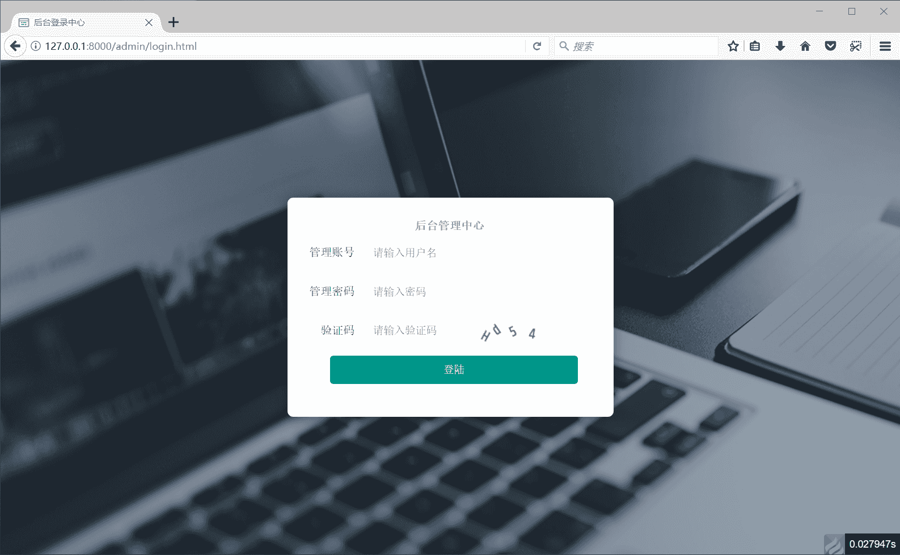
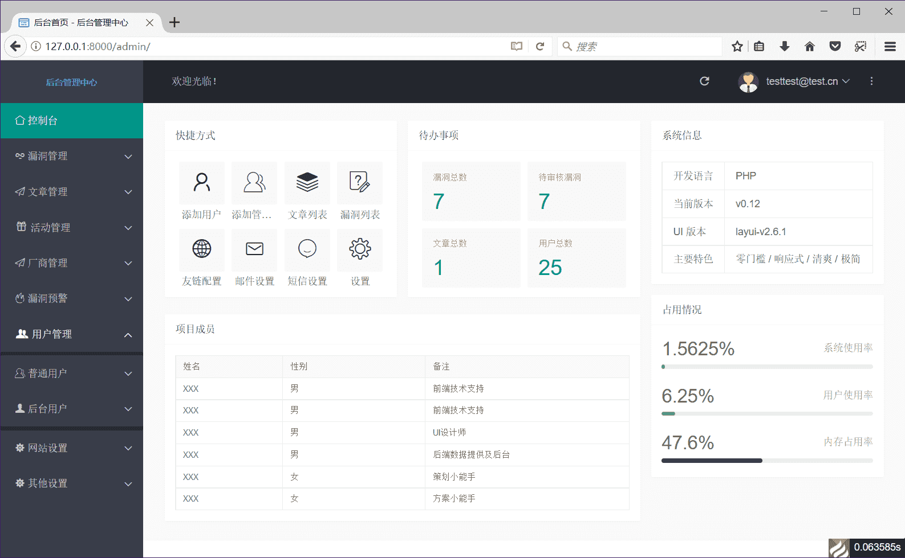
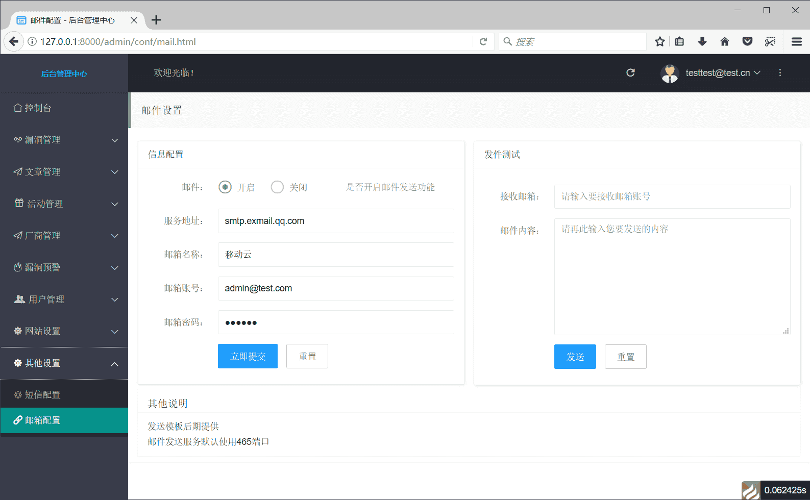

<!--
 * @Descripttion: 临时创建的项目
 * @version: 1.0.0
 * @Author: Xiaobai
 * @Date: 2021-05-12 12:25:25
 * @LastEditors: Xiaobai
 * @LastEditTime: 2021-07-30 20:24:23
 * @BlogSite: https://www.xiaobaibk.com
-->

### 一个使用ThinkPHP6 写的的后台管理平台

> 本来突发奇想，随手写的一个项目，需要的可以拿去二开,由于前端页面内容不是我写的,所以我就不提供了。

---

### 程序介绍

* php7+
* thinkphp6+
* mysql 5.7
* layui 2.1

---

### 页面截图





---

### 安装使用

- 新建个mysql数据库，并将根目录下的`install.sql`导入到刚才建立的对数据库里
- 开发时可将根目录下“.env”文件内的数据库信息修改为自己对应的信息
- 在上线阶段可修改config目录下的database.php文件，把里面内容改为自己所对应的数据库信息  （如下）

```php
            // 服务器地址
            'hostname'        => env('database.hostname', '127.0.0.1'),
            // 数据库名
            'database'        => env('database.database', 'cmsrc'),
            // 用户名
            'username'        => env('database.username', 'root'),
            // 密码
            'password'        => env('database.password', 'root'),
            // 端口
            'hostport'        => env('database.hostport', '3306'),
            // 数据库表前缀
            'prefix'          => env('database.prefix', 'src_'),

```

---

### 运行方法

* php7.x环境下
* 在根目录下执行`composer install`
* 把mysql服务打开`php think run`会返回对应的链接地址
* 后台地址：/admin
* 后台账号密码：testtest@test.cn / testtest
* 使用宝塔或者PHPstudy等搭建把root目录设置到public下，如果有问题就提一个issue

---

### 前端现有的前端接口

| 说明                                                             |    地址    |                 备注                 |
| ---------------------------------------------------------------- | :--------: | :-----------------------------------: |
| 文章列表                                                         |  /thread  |              get请求即可              |
| 根据id获取文章                                                   | thread/id |           get请求带上文章id           |
| 用户登录                                                         | user/login | 带上用户名密码等字段，会返回一个token |
| 别的没时间一一写出来了具体看 `\app\api\route`下的app.php路由表 |           |                                       |

**还有代码是没写完的，以后有时间会慢慢去优化的**问题还是很多

**持续开发中...**（希望不会放弃^_^）
